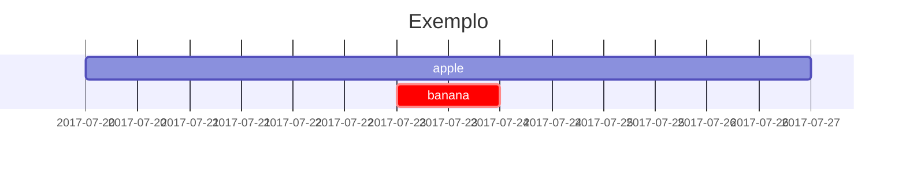

# Snippets — Guia de Referencia

> Como usar: `Ctrl+P` → **Templater: Insert template** → navegue ate `SNIPPETS/` e selecione o snippet desejado. Snippets com `<% tp.system.prompt() %>` abrem um dialogo pedindo input.

---

## Embeds (Midia Externa)

| Snippet | O que faz |
|---------|-----------|
| `embed-youtube` | Embed YouTube. Pede o Video ID (hash apos `v=` na URL) |
| `embed-bilibili` | Embed Bilibili. Pede o BV ID |
| `embed-video` | Embed video local. Pede caminho e titulo |
| `embed-audio` | Embed audio local. Pede caminho e titulo |

### Exemplo YouTube
```

```

### Exemplo video local
```

```

---

## Imagens

| Snippet | O que faz |
|---------|-----------|
| `img-inline` | Imagem simples. Pede path e alt text |
| `img-sized` | Imagem com largura customizada. Pede path, largura e alt |

### Paths usados no projeto
- **Banners (frontmatter):** `assets/img/post-banners/nome.png`
- **Imagens inline:** `assets/post-images/pasta-do-post/img.png`

### Exemplo inline
```html

```

### Exemplo com largura
```html

```

---

## Prompts (Callouts Chirpy)

| Snippet | Estilo | Cor |
|---------|--------|-----|
| `prompt-tip` | Dica | Verde |
| `prompt-info` | Informacao | Azul |
| `prompt-warning` | Aviso | Amarelo |
| `prompt-danger` | Perigo/Alerta | Vermelho |
| `prompt-idea` | Ideia | Roxo |

### Sintaxe
```markdown
{: .prompt-tip }
> Texto da dica aqui
```

> **Nota:** A linha `{: .prompt-tip }` deve vir DEPOIS do blockquote, separada por linha em branco.

---

## Blocos de Codigo

| Snippet | O que faz |
|---------|-----------|
| `code-block` | Bloco de codigo vazio com placeholder de linguagem |

### Linguagens comuns
`python`, `ruby`, `bash`, `javascript`, `json`, `html`, `css`, `plaintext`, `yaml`, `sql`, `java`, `c`, `cpp`

### Exemplo
````markdown
```python
def hello():
    print("Hello World")
```
````

---

## Footnotes

| Snippet | O que faz |
|---------|-----------|
| `footnote` | Insere `[^N]` no texto (referencia) |
| `footnote-def` | Insere `[^N]: definicao` (colocar no final do post) |

### Fluxo
1. Insira `footnote` no meio do texto → pede o numero
2. Insira `footnote-def` no final do arquivo → pede numero e URL/texto

### Exemplo
```markdown
Texto com referencia.[^1]

(... resto do post ...)

[^1]: https://exemplo.com/fonte
```

---

## Links Internos

| Snippet | O que faz |
|---------|-----------|
| `post-link` | Link para outro post do blog. Pede texto e slug |

### Exemplo
```markdown
[O limite da individualidade](/posts/limite-da-individualidade/)
```

> O slug e o que vem apos a data no nome do arquivo: `2026-05-24-limite-da-individualidade.md` → slug = `limite-da-individualidade`

---

## Matematica e Diagramas

| Snippet | O que faz | Requer frontmatter |
|---------|-----------|-------------------|
| `math-block` | Bloco LaTeX vazio | `math: true` |
| `mermaid` | Diagrama Mermaid vazio | `mermaid: true` |

### Exemplo math
```markdown
$$
\begin{equation}
  \sum_{n=1}^\infty 1/n^2 = \frac{\pi^2}{6}
\end{equation}
$$
```

### Inline math
```markdown
Quando $a \ne 0$, existem duas solucoes
```

### Exemplo mermaid
````markdown

````

---

## Tabelas

| Snippet | O que faz |
|---------|-----------|
| `table` | Tabela markdown 3x2 vazia |

---

## Blocos Compostos

| Snippet | O que insere |
|---------|-------------|
| `block-video-section` | Titulo + descricao + embed YouTube |
| `block-code-tutorial` | Subtitulo + callout tip + bloco de codigo |
| `block-quote-source` | Citacao + footnote com fonte |
| `block-image-gallery` | Galeria automatica de imagens de uma pasta |

### block-video-section
```
## [Titulo digitado]
[Descricao digitada]

```

### block-code-tutorial
```
### [Subtitulo]
{: .prompt-tip }
> [Descricao]
```language
[codigo]
```
```

### block-quote-source
```
> [Citacao]
[^N]: [Fonte URL/texto]
```

### block-image-gallery
```

```
> Para galeria, usar `layout: gallery` e `gallery_folder:` no frontmatter. Imagens vao em `gallery/subfolder/`.

---

## Frontmatter Quick Reference

```yaml
---
title: Titulo do Post
description: Descricao curta para SEO
date: 2025-06-07 15:30:00
author: Val                    # Val ou Alex
categories:
  - categoria-1
tags:
  - tag-1
  - tag-2
pin: false                     # true para fixar
image: assets/img/post-banners/nome.png
math: false                    # true para ativar MathJax
mermaid: false                 # true para ativar Mermaid
---
```

### Categorias usadas no blog
`programacao`, `ruby`, `python`, `music`, `review`, `gestao de conhecimento`, `obsidian`, `Reflexao`, `Escritas Pessoais`

### Tags usadas no blog
`Dicas`, `Review`, `Recursos`, `Insight`, `english`, `portugues`, `poema`, `Amor`

### Autores disponiveis
- `Val` → Valdenir Nonaka
- `Alex` → Alex Donega

---

## Deploy

1. Escreva o post em Obsidian usando estes snippets
2. Nome do arquivo: `YYYY-MM-DD-slug.md`
3. Coloque imagens em `assets/post-images/slug-do-post/`
4. Banner em `assets/img/post-banners/nome.png`
5. Git commit + push para `main`
6. GitHub Actions build automatico → deploy em GitHub Pages
